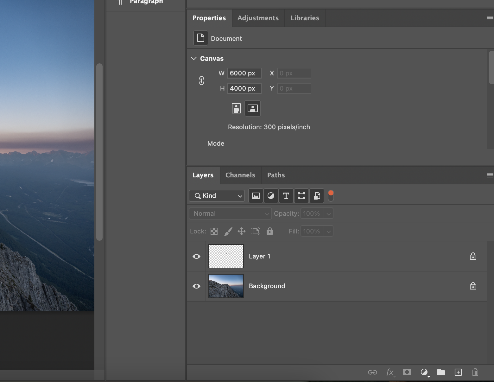

layers panel edits are permanent , smart ojects are non permanent these edits are saved as smart filters

# layers panel

## what is layers in photoshop

A Photoshop file is a stack of transparent sheets.
Each sheet contains different elements (text, image, shape, effects).
You can edit one sheet without touching the others.

layers are like sheets of paper stacked on top of each other. with this you can edit each sheet without affecting the others and each have different elements.

with layer you can do work on each sheet without affecting the others.like new tool or new work on new layer.

Layers follow top-to-bottom hierarchy:

- Top layer = visible above
- Bottom layer = background
- You can reorder by dragging

If something disappears:
👉 It may be hidden under another layer.

---

### Real-World Example

Imagine designing a YouTube thumbnail:

- Background image → Layer 1
- Cutout of person → Layer 2
- Text headline → Layer 3
- Color grading → Adjustment Layer
- Shadow effects → Layer Styles

Each can be modified separately.

---

# ui

you have layers option in right side of ui in panels and you see layers panel

the layers panel is divided into several sections:

### 1. Top Section – Layer Filtering Bar

This row helps you filter specific layer types.

🔍 “Kind” Dropdown
Lets you filter layers by type.
Icons next to “Kind”
These are quick filters:

- 🖼 Image icon → Pixel layers
- ◐ Half circle → Adjustment layers
- T → Text layers
- ⬛ Shape → Shape layers
- 📄 Smart Object icon
- 🔴 Color tag → Filter by layer color label

If filter is active, only those layers show.

---

### 2. Blending Mode & Opacity Area

Located right below filters.

**_Blending Mode (Default: Normal)_**

Dropdown (Normal, Multiply, Screen, Overlay, etc.)
Controls how this layer interacts with layers below it mathematically.

**_Examples_**:

- Multiply → Darkens
- Screen → Lightens
- Overlay → Contrast boost

**_Shortcut_**:

- Shift + + → Next blending mode
- Shift + - → Previous blending mode

#### Opacity

Controls transparency of the whole layer.

**_Shortcut_**:

Press number keys (with Move Tool selected)

5 → 50%
8 → 80%
0 → 100%
25 → 25%

---

### 3. Fill

Like opacity but only affects layer pixels, not layer styles (like shadows).
Used heavily in advanced effects.

---

### 4. Lock Options

Below blending mode:

**_Icons_**:

🔲 Lock Transparent Pixels
🖌 Lock Image Pixels
🔀 Lock Position
🔒 Lock All

**_Professionals use_**:

- Lock Transparent Pixels when painting on cutouts.

**_Shortcut_**:

- / (slash) toggles Lock Transparent Pixels

---

### 5. The Layer Stack (Main Area)

This is the vertical hierarchy.

Top layer = visible above
Bottom layer = base

#### Elements inside each layer row

**_Eye Icon_**

Toggle visibility.

**_Shortcut_**:

- Click
- Alt + Click → Solo view (hide all others)

**_Thumbnail_**

Small preview of layer content.
If checkerboard → transparent pixels.

**_Layer Name_**

Double click to rename (always rename in professional workflow).

**_Lock icon (right side)_**
If locked, you cannot edit.

**_Background layer is locked by default._**

**_To unlock_**:

- Double click “Background”

---

### 6. Bottom Action Bar (Very Important)

These icons are critical.

**_From left → right:_**

#### 🔗 Link Layers

Links selected layers so they move together.

need to select more than one layer to link them. can use by holding cmd (mac) or ctrl (windows) and clicking on layers.

#### fx (Layer Styles)

Adds:

Drop Shadow
Stroke
Outer Glow
Gradient Overlay
Bevel & Emboss

**_Shortcut_**:

Double click empty space of layer
Or right click → Blending Options

#### ⭕ Layer Mask

Adds white mask (reveals everything)
Black hides, white reveals.

**_Shortcut_**:

- Click mask icon
- Alt + Click → Black mask

#### ◐ Adjustment Layer

Professionals NEVER use Image → Adjustments.
They use adjustment layers.

if we make adjustment directly to the image then we cannot roll back that is destructive adjustment

so we use adujustment layer so that the adjustments are added as layers which can be edited or removed later

**_Creates non-destructive adjustment:_**

An Adjustment Layer in Adobe Photoshop is a non-destructive color and tonal correction layer.
It modifies layers below it without permanently changing pixels.

Method 1 (Professional Way)

Bottom of Layers Panel → Click the half black/white circle icon

Method 2

Layer → New Adjustment Layer

lets say we have portiait of virat at top and we want to add brightness contrast to it we can add brightness contrast as layer and it will be added below the portiait layer and we can edit it or remove it later. this will not be applied to other layers below it

Most Important Adjustment Layers

| Adjustment              | Use Case                                   |
| ----------------------- | ------------------------------------------ |
| **Brightness/Contrast** | Basic exposure correction                  |
| **Levels**              | Control shadows, midtones, highlights      |
| **Curves**              | Advanced tonal control (industry standard) |
| **Hue/Saturation**      | Change color intensity                     |
| **Color Balance**       | Shift color tones                          |
| **Black & White**       | Professional monochrome conversion         |
| **Gradient Map**        | Cinematic color grading                    |

Why Adjustment Layers Are Important

✅ Non-destructive
✅ Editable anytime
✅ Comes with built-in mask
✅ Can clip to one layer
✅ Blend mode compatible

Key Concepts

1️⃣ It Has a Mask Automatically

Every adjustment layer comes with a white mask.

White → effect visible
Black → effect hidden
Gray → partial effect

2️⃣ Clipping to One Layer

If you don’t want it affecting all layers below:

Hold Alt/Option

Click between layers
→ Creates a Clipping Mask

3️⃣ Blend Modes Work

Example:

Set Curves to Luminosity to avoid color shift
Set Gradient Map to Soft Light for cinematic look

Professional Workflow Example

Exposure fix → Curves
Color correction → Color Balance
Skin tone adjust → Hue/Saturation (clipped)
Final contrast → Levels

All editable anytime.

Core Difference

| Direct Adjustment | Adjustment Layer |
| ----------------- | ---------------- |
| Permanent         | Editable anytime |
| Damages pixels    | Non-destructive  |
| No mask           | Has mask         |

---

#### 📁 New Group

Creates folder.

**_Shortcut_**:

Ctrl + G (Cmd + G Mac)

#### ➕ New Layer

Creates empty pixel layer.

**_Shortcut_**:

Ctrl + Shift + N

#### 🗑 Delete Layer

Deletes selected layer.

**_Shortcut:_**

Delete key

or select layer use delete symbol or drab the layer to that symbol

---

========================================================================================

### Key Layer Properties

Inside the Layers Panel, you control:

| Property        | What It Does                          |
| --------------- | ------------------------------------- |
| Visibility (👁) | Show/Hide layer                       |
| Opacity         | Transparency control                  |
| Blending Mode   | How layer interacts with layers below |
| Lock            | Prevent edits                         |
| Layer Mask      | Hide parts non-destructively          |
| Effects (FX)    | Add shadow, glow, stroke, etc         |

## Types of Layers in Photoshop

### 1️⃣ Pixel (Raster) Layer

- Contains actual image pixels.
- Used for photos and painting.

### 2️⃣ Text Layer

- Editable typography.

### 3️⃣ Shape Layer

- Vector-based shapes (scalable without quality loss).

### 4️⃣ Adjustment Layer

- Applies color/lighting corrections without modifying the original image.

### 5️⃣ Smart Object

- A protected container layer that preserves original data.

---

            background layer

first initialized layer is background layer and we can't delete it

to unlock the background layer we need to right click on the background layer and click on unlock or click on lock symbol

and to make any other layer background layer

go to layer menu and new and select layer from background

---

                        Smart Object

A protected container layer that preserves original data.
smart object is used to preserve the original data of the image it doesnt allow to make the edits on that layer
smart object have a small icon on the bottom right corner of the layer thumbnail

smart object is like a layer which is protected from the edits and all the edits maded are added kind of adons to the smart object called smart filter

Right-click layer → Convert to Smart Object. -- to make a smart object
File → Place Embedded (automatically creates Smart Object)

if you want to edit right click on the layer and cover to raster

mask works best with smart object which makes a deadly combo of non destructive editing

--
we covert layer into smart objects to protect the quality while editing

In normal raster layers:

If you scale down → quality is lost.
If you apply a filter → it permanently changes pixels.
If you transform multiple times → degradation occurs.

With Smart Objects:

Transformations are reversible.
Filters become editable (“Smart Filters”).
Original data remains intact.

these are saved as smart filters (similar like layers)

❌ What You Cannot Edit Directly

1. Paint or Erase Directly

Brush, Eraser, Clone Stamp won’t work on the Smart Object surface.
You must:
Rasterize it, or
Edit contents inside.

2. Pixel-Level Tools (Directly)

3. Partial Pixel Deletion

4. Certain Adjustments (Direct Apply)

Image → Adjustments applies destructively only after rasterizing.

5. Merging Into It

---

Fill vs Opacity

Both control transparency — but they affect different parts of a layer.

Opacity

Controls everything on the layer:

- Pixels
- Layer styles (Drop Shadow, Stroke, Glow, etc.)

If Opacity = 50% →
Entire layer becomes 50% transparent.

Shortcut:
Press number keys (5 = 50%, 0 = 100%)

Fill

Controls only the actual pixels/content, NOT the layer styles.

fill doesnt effect the layer styles it only effect the pixels of the layer

If Fill = 0% →
Pixels disappear
Layer styles remain visible

Professional Example:-

Add text → Add Drop Shadow

Opacity 0% → Text AND shadow disappear
Fill 0% → Text disappears, shadow stays

This is used for:

Glow effects
Outline-only text
Glass UI effects
Advanced compositing tricks

| Feature                      | Opacity   | Fill       |
| ---------------------------- | --------- | ---------- |
| Affects pixels               | Yes       | Yes        |
| Affects layer styles         | Yes       | No         |
| Used for normal transparency | Yes       | Rarely     |
| Used for special effects     | Sometimes | Very Often |

If you want everything to fade → use Opacity
If you want effects visible but hide content → use Fill

---

## Most Used Professional Shortcuts

These are the ones that actually matter in real workflows:

### Layer Creation & Management

Ctrl + Shift + N → New layer
Ctrl + J → Duplicate layer
Ctrl + G → Group layers
Ctrl + Shift + G → Ungroup
Ctrl + E → Merge down
Ctrl + Shift + E → Merge visible
Ctrl + Alt + Shift + E → Stamp visible (pro move)

### Visibility & Selection

Alt + Click eye → Solo layer
Ctrl + Click thumbnail → Load selection
Shift + Click layers → Multi-select

### Masks

Add mask → Click mask icon
Alt + Click mask → View mask
Shift + Click mask → Disable mask
Ctrl + I (on mask) → Invert mask

### Moving Layers

V → Move tool
Ctrl + ] → Move layer up
Ctrl + [ → Move layer down
Ctrl + Shift + ] → Bring to front
Ctrl + Shift + [ → Send to back

### Opacity Quick Control

1 → 10%
5 → 50%
0 → 100%

### 7. Professional Layer Discipline (Important)

#### Beginners:

- Leave names like Layer 1, Layer 2
- Directly erase pixels
- Flatten early

#### Professionals:

- Rename everything
- Use masks instead of eraser
- Use adjustment layers
- Group logically

Color-code layers

Keep file editable until final export

Final Mental Model

Layers Panel = Your project architecture.

If you don’t control it:
Your design becomes chaos.

If you structure it:
You work like an industry retoucher or designer.

---

                  layers order

Think of Layers Like a Stack

Top layers affect what’s underneath them.

So if your structure looks like this:

Text Layer
Color Balance (Adjustment Layer)
Image Layer
Background

The Color Balance will affect:

✔ Image Layer
✔ Background

❌ It will NOT affect the Text Layer (because text is above it)

🎯 How to Control It Precisely
1️⃣ Affect Only One Layer (Clipping Mask)

If you want the adjustment to affect only the layer directly below:

Right-click Adjustment Layer → Create Clipping Mask

Shortcut:
Alt/Option + Click between layers

Now it affects only that one layer.

2️⃣ Limit It with a Mask

Every Adjustment Layer comes with a Layer Mask.

White → visible
Black → hidden

So you can paint where the effect appears.

3️⃣ Limit It Using Blend If (Advanced)

Double click adjustment layer → Use Blend If
Now it affects only highlights, shadows, or midtones.

Professional retouchers use this heavily.

⚠ Important Detail

Adjustment Layers are:

✔ Non-destructive
✔ Editable anytime
✔ Stackable
✔ Reorderable

And their effect changes depending on:

Layer order

Blend mode

Opacity

Clipping mask

Mask painting

🔥 Real Industry Workflow

Professionals usually:

• Keep base image at bottom
• Stack corrections (Exposure → WB → Contrast)
• Then stack grading layers
• Then special effects

All controlled via masks and clipping.
